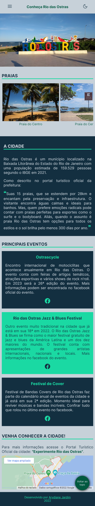

# Projeto Turismo - Conheça Rio das Ostras

O Conheça Rio das Ostras é um site sobre o turismo desta localidade. Onde encontramos as praias, principais eventos e como chegar na cidade.
Este projeto foi construído utilizando a técnica mobile first, com padrão de nomenclatura de classes BEM e manipulação de DOM com JavaScript.

## 💻 Layout  

### Web

  

### Mobile

  

 ## 🔧 Tecnologias 

As tecnologias usadas foram: 
* HTML
* CSS
* JavaScript
